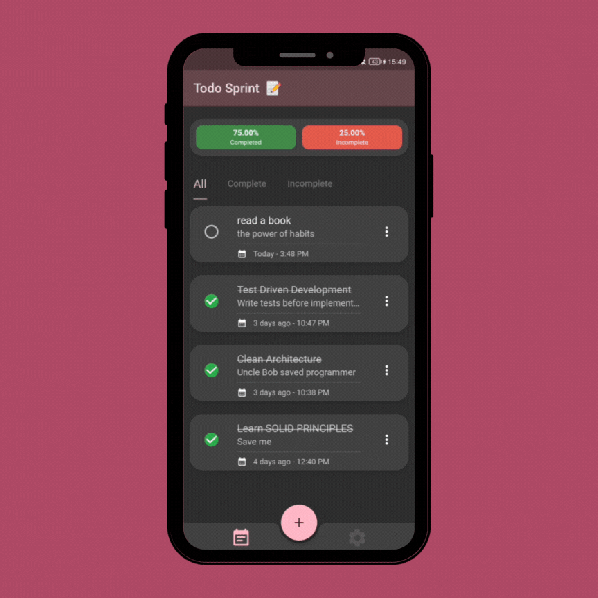
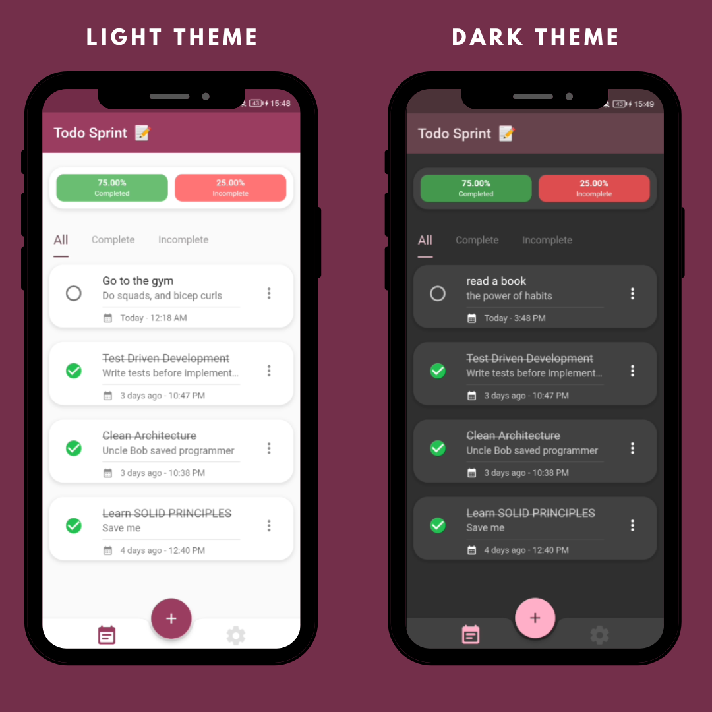
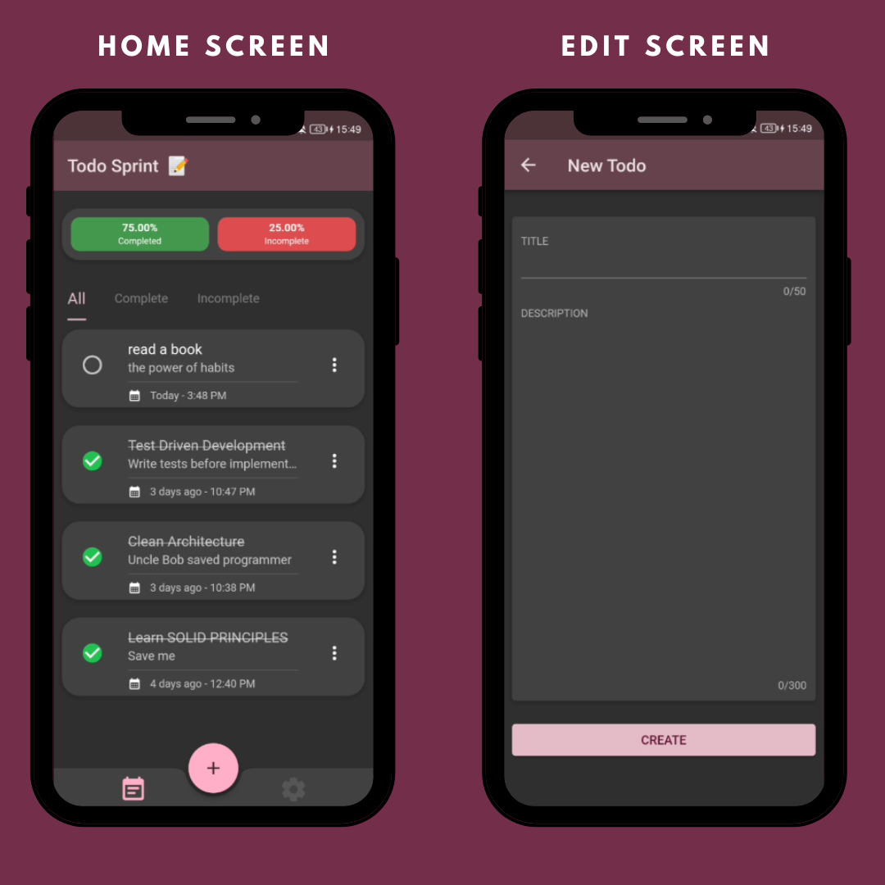
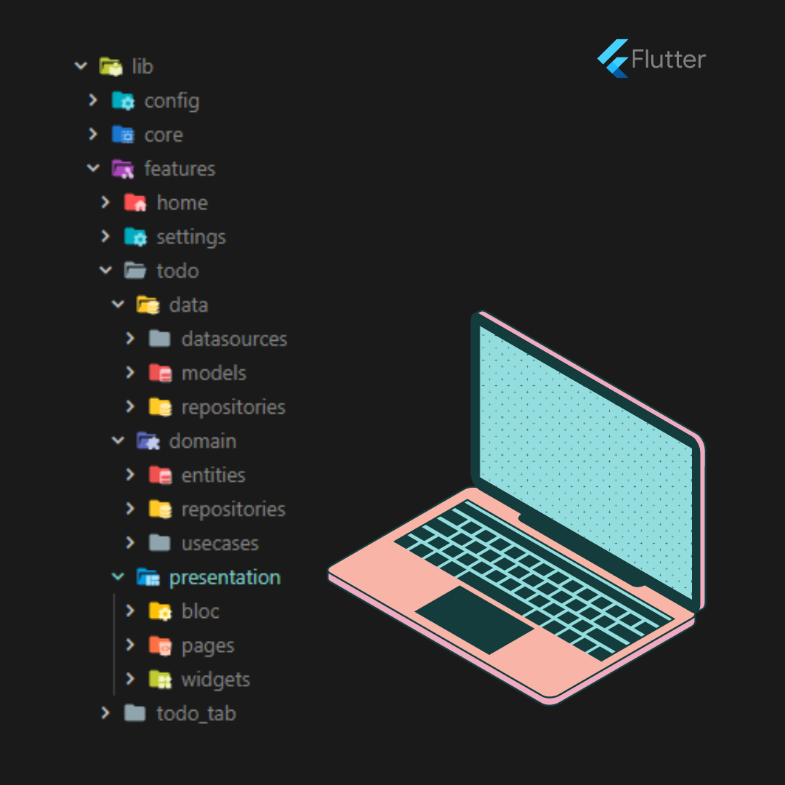
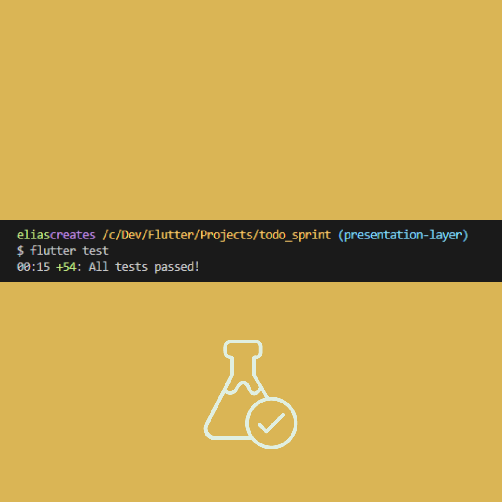

# Todo Sprint App 📝

Todo Sprint is a simple and efficient todo app built with Flutter using Clean Architecture principles. It allows you to manage your tasks, and stay organized throughout the day. The app follows the BLoC pattern for state management and utilizes Hive for local data storage.

</a>

## Screenshots

</a>
</a>
</a>
</a>

## Features

- Create new tasks with a title and description.
- Mark tasks as completed or uncompleted.
- View a list of all tasks.
- Delete completed tasks.
- Switch between light and dark themes.

## Getting Started

Follow these instructions to get the app up and running on your local machine.

### Prerequisites

Before running the app, make sure you have Flutter installed on your system. If you haven't installed Flutter yet, follow the official Flutter installation guide: [Flutter Installation](https://flutter.dev/docs/get-started/install)

### Installing

1. Clone this repository to your local machine using Git:

```
git clone https://github.com/eliascreates/todo-sprint.git
```

2. Change to the project directory:

```
cd todo-sprint
```

3. Install the required dependencies:

```
flutter pub get
```

4. Run the app:

```
flutter run
```

The app should now be running on your emulator or connected device.

## Folder Structure

The project follows a Clean Architecture structure to separate concerns and make the codebase maintainable and scalable.

- `lib/` contains the application code.
  - `feature/` contains the features in the application.
    - `todo/` contains the todo feature with CRUD operations
        - `data/` contains the data layer with repository and data sources implementations.
        - `domain/` contains the domain layer with entities, use cases, and repositories interfaces.
        - `presentation/` contains the presentation layer with the UI, BLoCs, and other UI-related components.

## State Management

The app uses the BLoC (Business Logic Component) pattern for state management. BLoC allows for separation of UI and business logic and provides a clean way to manage the state of the application.

## Data Storage

The app uses Hive as the local data storage solution for storing todo items. Hive is a lightweight and fast NoSQL database that works well with Flutter apps.

## Themes

Todo Sprint offers both light and dark themes to provide a personalized user experience. You can switch between themes from the app settings.


## Getting Started

This project is a starting point for a Flutter application.

A few resources to get you started if this is your first Flutter project:

- [Lab: Write your first Flutter app](https://docs.flutter.dev/get-started/codelab)
- [Cookbook: Useful Flutter samples](https://docs.flutter.dev/cookbook)

For help getting started with Flutter development, view the
[online documentation](https://docs.flutter.dev/), which offers tutorials,
samples, guidance on mobile development, and a full API reference.
